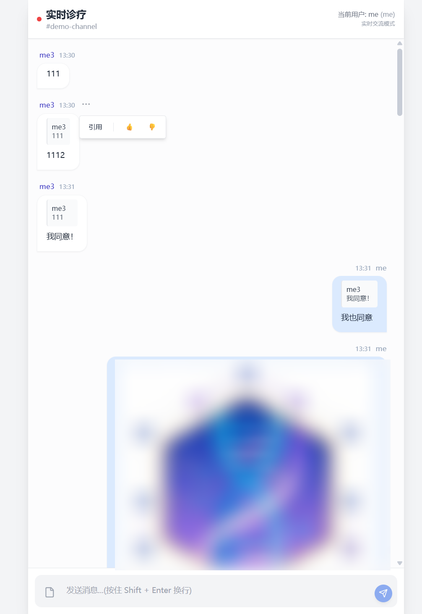

# 实时聊天 (Chat)

本仓库是一个轻量的实时聊天演示应用（前后端同仓），用于展示即时消息、文件上传、引用、表情反应、撤回、乐观更新以及通过 HTTP 接口外部发送消息的能力。适合作为小型内网工具或作为学习 socket.io + Express + 简单前端集成的示例。



## 主要特性

- 实时通信：基于 socket.io，客户端连接后加入频道（room），服务端通过 `io.to(channelId).emit` 广播。
- 任意文件上传：支持上传任意类型的文件并返回元信息 `{ url, originalName, mimeType, size }`，图片会作为预览显示，其他文件显示为可下载卡片。
- 文本消息与多行支持：输入框支持 `Shift+Enter` 插入换行，`Enter` 发送（可配置/扩展）。消息在显示端保留换行（使用 CSS `pre-wrap`）。
- 乐观更新：发送消息时客户端会生成 `clientId` 并立刻把消息加入本地列表（pending），服务器回执后会替换或更新。
- 用户标识与配色：支持 `userid` 与 `username`，客户端根据 `userid` 为用户名着色，方便区分不同用户。
- 引用（Reply/Quote）：可以引用已有消息，引用信息通过 `quotedMessageId` 随消息保存与广播，点击引用可跳转并闪烁目标消息。
- 反应（Reactions）：支持简单表情反应（如 /），通过 socket 同步到所有客户端。
- 撤回（Recall）：发送者可在两分钟内撤回自己的消息，撤回后会把消息标记为 `retracted` 并在 UI 中展示占位文本。
- 外部 HTTP 推送：新增 `POST /api/send-msg`，允许外部系统以 HTTP 请求发送消息到指定频道（同样会持久化并广播）。
- 日志持久化：消息以 JSON 文件保存在 `logs/<channelId>.json`，方便调试与历史拉取。
- 调试接口：`GET /api/room/:channelId` 可查看当前在房间内的 socket 列表（用于诊断未收到广播的问题）。

## 项目结构

- `index.html`：前端单文件应用（Vue 3 全局构建 + Tailwind 样式 + socket.io-client）。
- `server.js`：后端主程序（Express + socket.io + multer），提供上传、消息持久化、HTTP API 与 socket 事件。
- `package.json`：项目依赖与脚本。
- `logs/`：按频道存放消息日志（JSON 数组）。
- `uploads/`：后端保存的上传文件（静态服务）。

## 安装与运行

1. 克隆仓库并进入目录：

```powershell
cd D:\Lab\pj\chat
```

2. 安装依赖：

```powershell
npm install
```

3. 启动服务器：

```powershell
node server.js
```

或者如果 `package.json` 有 `start` 脚本：

```powershell
npm start
```

4. 打开浏览器访问前端：

- 直接打开 `index.html`（开发模式下推荐通过本地静态服务或直接在文件系统打开即可，但若浏览器阻止跨域资源而影响上传，请使用 `http-server` 或其他本地静态服务器）。
- 默认后端监听 `http://localhost:3000`（在 `index.html` 中 `SERVER_URL` 常量可修改）。

注意：如果你在 Windows PowerShell (v5.1) 使用命令行发出 JSON/HTTP 请求（例如调用 `/api/send-msg`），请确保使用能够发送 UTF-8 的客户端（或在 PowerShell 中显式指定编码），否则中文会发生编码问题。推荐使用 `curl.exe`（随 Windows 10+ 可用），或用 `Invoke-RestMethod` 时构造正确的 `System.Text.UTF8Encoding`。示例：

使用 curl.exe（PowerShell 下）：

```powershell
curl.exe -X POST "http://localhost:3000/api/send-msg" -H "Content-Type: application/json; charset=utf-8" -d '{"channelId":"demo-channel","userid":"u1","username":"张三","content":"你好，\n这是第二行"}'
```

或使用 Node/JS 脚本/HTTP 客户端发送 UTF-8 编码的请求。

## HTTP API（后端）

- POST /api/upload

  - 表单字段：`file` (multipart file)，可选 `channelId, username, userid, clientId, quotedMessageId`
  - 返回：{ url, originalName, mimeType, size }
  - 如果带 `channelId`，后端会把上传结果作为消息写入该频道日志并广播 `newMessage`。
- POST /api/send-msg

  - JSON body: `{ channelId, userid, username, content, type?='text', clientId?, quotedMessageId? }`
  - 功能：持久化消息到 `logs/<channelId>.json` 并通过 socket.io 广播 `newMessage` 至该频道。
- GET /api/history/:channelId

  - 返回该频道的消息历史（JSON 数组）。
- GET /api/room/:channelId

  - 调试接口，返回当前在该房间的 socket id 列表与数量（用于排查广播/未加入的问题）。
- Socket 事件（客户端 -> 服务端）

  - `join` (channelId) : 将 socket 加入频道。
  - `identify` ({ userid, username }) : 可选，用于服务端记录/调试。
  - `message` (messageObj) : 客户端直接通过 socket 发送消息对象（服务端会持久化并广播）。
  - `reaction` ({ channelId, messageId, userid, action }) : 切换或新增 reaction 并广播 `updateMessage`。
  - `recall` ({ channelId, messageId, userid }) : 请求撤回，服务端检查权限与时效并广播更新。
- Socket 事件（服务端 -> 客户端）

  - `newMessage` (msg) : 服务端持久化后发送的新消息。
  - `updateMessage` (msg) : 消息状态或 reaction 更新（客户端合并更新）。
  - `history` (logs) : 一次性发送历史（如果实现）。

## 前端行为/契约（`index.html`）

- 连接建立：客户端 `socket.on('connect')` 时会 `emit('join', channelId)` 并 `emit('identify', { userid, username })`。
- 乐观更新：发送消息（文本或文件）前由客户端生成 `clientId` 并立刻 `messages.push({... pending: true})`，收到服务端通过 `messageId` 或回填后会 `mergeMessage` 替换 pending 项。
- 引用：引用消息时，客户端在发送时随 `quotedMessageId` 字段发送，消息在 UI 中显示引用预览，点击可滚动并高亮目标消息。
- 输入行为：输入框支持 `Shift+Enter` 插入换行（手动处理以避免双换行），`Enter` 发送消息。发送后会清除 `replyTo`（引用状态）。
- 消息显示：文本消息使用 `white-space: pre-wrap`，以保留换行与空格。

## 数据模型（消息示例）

```json
{
  "messageId": "<server-generated-id>",
  "clientId": "<client-temp-id>",
  "time": "2025-12-02T12:34:56.789Z",
  "sender": "张三",
  "userid": "u1",
  "type": "text|file|image",
  "content": "..." or { "url": "/uploads/..", "originalName":"doc.pdf", "mimeType":"application/pdf", "size":12345 },
  "quotedMessageId": "<messageId或clientId>",
  "reactions": { "like": ["u1","u2"], "disagree": ["u3"] },
  "retracted": false
}
```

## 部署建议

- 生产环境请把 `SERVER_URL` 设置为实际服务地址并关闭 `FORCE_SIMULATION_MODE`。
- 上传目录 `uploads/` 与日志目录 `logs/` 需有写权限并根据需要做周期清理或转移到外部持久化存储（S3 等）。
- 若需要 HTTPS，请在反向代理层（nginx/traefik）增加 TLS，并把后端绑定到本地端口。

## 常见问题与调试

- 客户端不收到 `newMessage`：

  - 检查服务端日志是否有广播输出（`[send-msg] broadcast` 等调试日志）。
  - 使用 `GET /api/room/:channelId` 查看是否有 socket id 在房间内（若为空表示客户端未成功 `join`）。
  - 确认客户端在连接后执行了 `socket.emit('join', channelId)`（在浏览器控制台查看 network/socket events）。
- 中文在 PowerShell 下通过 `curl`/`Invoke-RestMethod` 发送出现乱码：请使用 `curl.exe` 并显式指定 `charset=utf-8`，或用 Node/其他 HTTP 客户端确保 UTF-8 编码。
- `node server.js` 退出（Exit Code 1）：请查看控制台 stderr 输出（通常会给出缺失依赖或端口占用信息），将错误粘贴到 issue 或聊天中以便定位。

## 开发者说明

- 前端为单文件 `index.html`，便于快速迭代与 demo。该文件内包含：UI、socket 客户端逻辑、上传/dispatch、面板对齐、引用/闪烁、乐观更新合并逻辑等。
- 后端在 `server.js` 中负责：文件上传（multer）、消息持久化（写入 `logs/<channelId>.json`）、socket.io 事件处理与广播、简易调试接口。
- 若需扩展：可把后端持久化替换为数据库（Mongo/Postgres），并加入鉴权（JWT/session）以保护写入与撤回操作。

## 贡献与许可

欢迎改进与复用；本项目为示例性代码，不包含复杂的安全/权限校验。若用于生产，请补充鉴权、输入校验、上传类型/大小限制、以及审计与清理机制。

---

如果你希望我把 README 的某部分翻译为英文、或补充具体的 API 请求示例（包括 PowerShell/Node/curl）及完整的示例脚本，我可以继续完善.

> 本项目由copilot、gemini辅助开发
